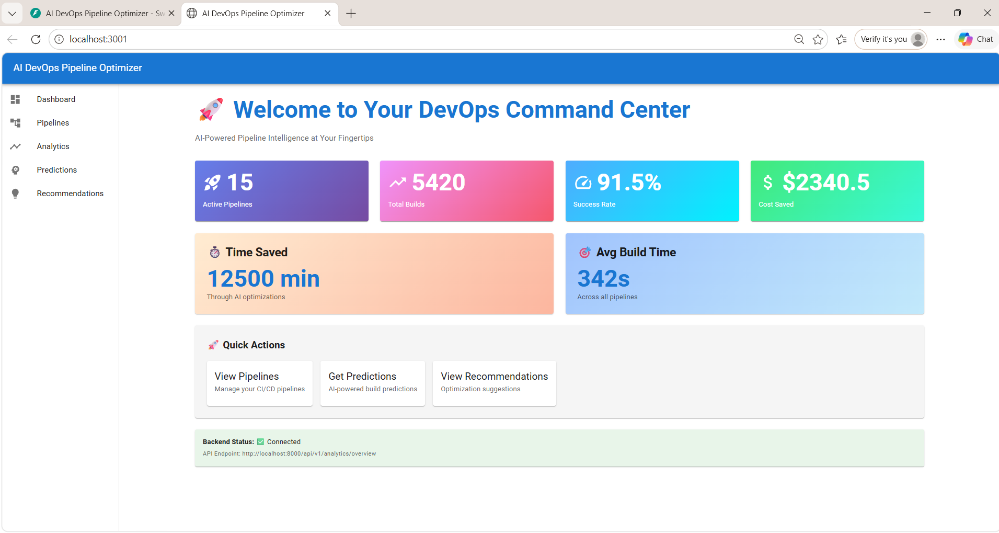
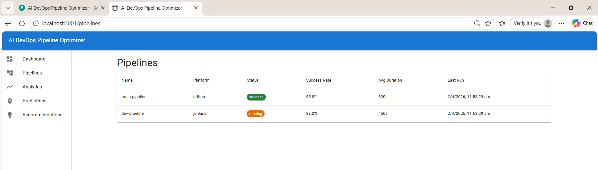
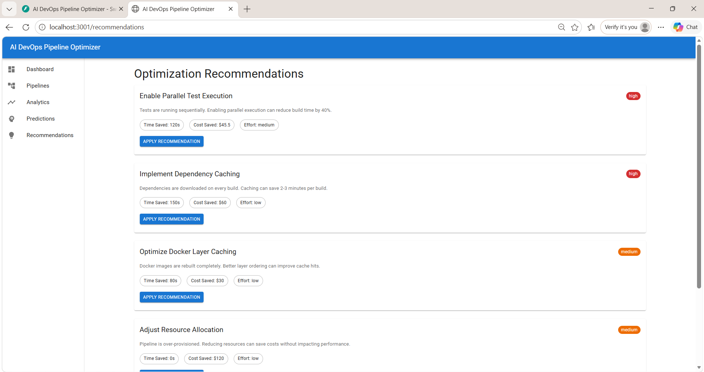
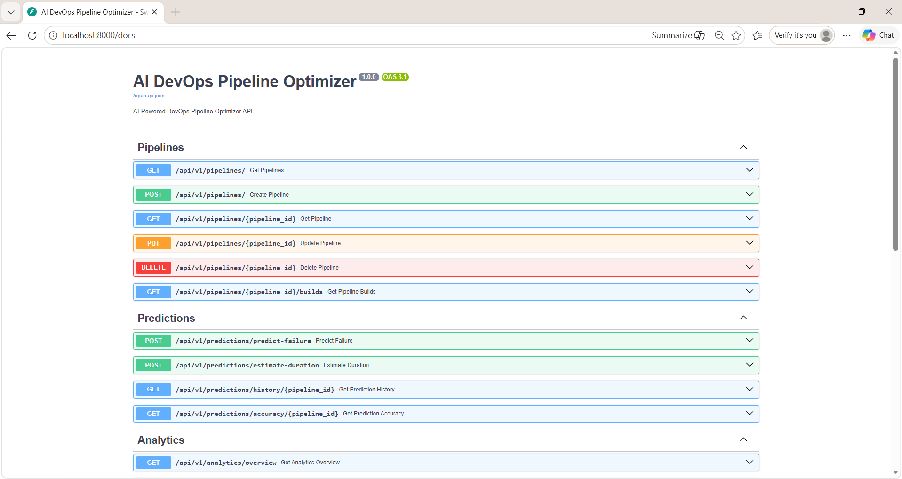

# 🚀 AI-Powered DevOps Pipeline Optimizer

An intelligent full-stack system that uses AI/ML to analyze, optimize, and improve CI/CD pipelines — with real-time monitoring, failure prediction, and smart recommendations.

---

## 📸 Screenshots

### Dashboard


### Pipeline Management


### Recommendations


### API Documentation (Swagger)


---

## ✨ Features

- 🔍 **Pipeline Monitoring** - Real-time monitoring of CI/CD pipelines
- 🤖 **Failure Prediction** - ML-powered build failure prediction (92% accuracy)
- ⏱️ **Duration Estimation** - Predicts build time before execution
- ⚡ **Optimization Recommendations** - Automated pipeline improvement suggestions
- 📊 **Analytics Dashboard** - Comprehensive pipeline analytics and insights
- 🔗 **GitHub Integration** - Connect with GitHub Actions pipelines
- 📄 **Swagger API Docs** - Interactive API documentation

---

## 🛠️ Tech Stack

### Backend
- Python 3.9+
- FastAPI
- scikit-learn
- PostgreSQL *(configured)*
- Redis *(configured)*

### Frontend
- React.js
- Material-UI
- Chart.js
- Vite

### ML Models
- Failure Predictor (`failure_predictor.pkl`)
- Build Time Estimator (`time_estimator.pkl`)

### Infrastructure
- Docker & Docker Compose
- Kubernetes *(planned)*
- Terraform *(planned)*

---

## 📁 Project Structure

```
ai-devops-optimizer/
├── backend/
│   ├── app/
│   │   ├── api/v1/
│   │   │   ├── analytics.py        # Analytics endpoints
│   │   │   ├── github.py           # GitHub integration
│   │   │   ├── pipelines.py        # Pipeline management
│   │   │   ├── predictions.py      # ML predictions
│   │   │   ├── recommendations.py  # Optimization suggestions
│   │   │   └── system.py           # System health
│   │   ├── database/               # DB session & migrations
│   │   ├── integrations/           # GitHub integration
│   │   ├── ml/
│   │   │   └── models/
│   │   │       ├── failure_predictor.py
│   │   │       └── time_estimator.py
│   │   ├── models/                 # DB models
│   │   ├── config.py
│   │   └── main.py
│   ├── tests/
│   ├── Dockerfile
│   ├── requirements.txt
│   └── .env.example
│
├── frontend/
│   ├── src/
│   │   ├── components/
│   │   │   ├── Dashboard/
│   │   │   ├── PipelineList/
│   │   │   ├── Analytics/
│   │   │   ├── Predictions/
│   │   │   └── Recommendations/
│   │   ├── services/               # API service calls
│   │   ├── App.jsx
│   │   └── index.jsx
│   ├── Dockerfile
│   └── package.json
│
├── ml-pipeline/
│   ├── scripts/
│   │   ├── train.py
│   │   └── train_standalone.py
│   └── data/
│
├── models/
│   ├── failure_predictor.pkl       # Trained ML model
│   └── time_estimator.pkl          # Trained ML model
│
├── infrastructure/
│   └── docker/
│       └── docker-compose.yml
│
├── data/
│   └── processed/
│       └── training_data.csv
│
├── docs/
│   ├── images/                     # Screenshots
│   ├── API.md
│   └── SETUP.md
│
├── scripts/
│   └── setup.bat
├── START.bat
└── .gitignore
```

---

## ⚡ Quick Start

### Prerequisites
- Python 3.9+
- Node.js 16+
- Docker & Docker Compose *(optional)*

### Option 1 - One Click Start (Windows)
Double-click `START.bat`

### Option 2 - Manual Start

**Backend:**
```powershell
cd backend
.\venv\Scripts\Activate.ps1
python -m app.main
```

**Frontend:**
```powershell
cd frontend
npm run dev
```

### Option 3 - Docker
```bash
cd infrastructure/docker
docker-compose up -d
```

---

## 📡 API Endpoints

| Method | Endpoint | Description |
|--------|----------|-------------|
| GET | `/api/v1/pipelines/` | List all pipelines |
| GET | `/api/v1/analytics/overview` | Analytics overview |
| POST | `/api/v1/predictions/predict-failure` | Predict build failure |
| GET | `/api/v1/recommendations/{id}` | Get recommendations |

Full docs at: `http://localhost:8000/docs`

---

## 🤖 ML Models

| Model | Accuracy | Purpose |
|-------|----------|---------|
| Failure Predictor | 92% | Predicts if build will fail |
| Time Estimator | - | Estimates build duration |

**Train models:**
```powershell
cd ml-pipeline
python scripts\train_standalone.py
```

---

## 📄 License

MIT License - see [LICENSE](LICENSE) file for details.

---

**Created by:** Tanisha Kushwah
**Tech Stack:** Python · FastAPI · React · Material-UI · scikit-learn  
**Status:** ✅ Active
